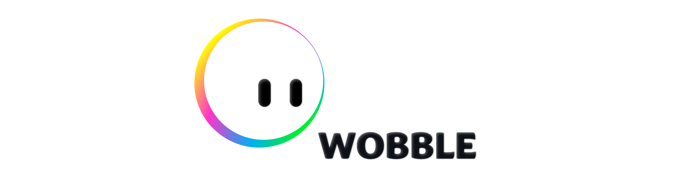

# WOBBLE – Hybrid Prototyping Methodology
*Eindwerk Opkomende technologieën*

**Contributors**
- Name(s) : De Bleser, Axelle; Rootsaert, Selena
- Course : Opkomende Technologieën
- Academic year : 2025-2026
- Project Supervisor : Prof. Devriese, Wouter

## Abstract

Binnen het project Opkomende Technologieën werd verder gewerkt op een bestaand concept en een semi functioneel prototype van Wobble, een interactieve calming companion voor kinderen. Binnen dit technologisch project lag de focus op de technische validatie van verschillende hybride interacties tussen hardware, Arduino en Protopie.

  
   
  Figuur 1. Logo Wobble

Het project onderzoekt hoe een fysieke input via een druksensor kan worden vertaald naar zowel een motorische output als een visuele interface op een extern scherm. Hiervoor werd een systeem opgebouwd waarbij een Force Sensitive Resistor (FSR) waarden doorstuurt naar Arduino, waarna deze informatie via serial communication wordt verwerkt in Protopie Connect.

Afhankelijk van de uitgelezen drukwaarde verandert de interface van toestand :
- neutraal,
- blij,
- verdrietig.

Daarnaast werd een fysieke drukknop toegevoegd om het motorsysteem gecontroleerd te activeren. Om het systeem uit te schakelen werd gebruik gemaakt van de force sensitive resistor om te registreren of Wobble nog vastgehouden wordt door de gebruiker.

Binnen dit project werd voornamelijk gefocust op :
- hardwarevalidatie,
- logische programmatie,
- serial communication,
- Protopie Connect,
- hybride interacties tussen fysieke en digitale componenten.

## Content table
1. [Conceptual Operation](docs/Algemene_werking.md)
2. [Prototype Architecture](docs/fysiek_prototype.md)
3. [Arduino Code](docs/arduino_code.md)
4. [Protopie Documentation](docs/protopie_documentation.md)

## Resultaat

## Reflectie
Het was een uitdaging om ons project te koppelen aan dat van project gebruiksgericht ontwerp omdat de nodige prototypes voor project gebruiksgericht ontwerp simpeler waren met arduino.

Om wat extra moeilijkheid toe te voegen werd de druksensor en het protopie programma toegevoegd. Deze twee met elkaar connecteren was het moeilijkste deel. Uiteindelijk zijn we blij met ons eindresultaat. Ook de kleurovergang op protopie was een uitdaging.

We hadden ervoor gekozen om geen omhulsel te maken omdat we ons wilden focussen op de werking, indien we meer tijd hadden konden we toch een behuizing voorzien. 
