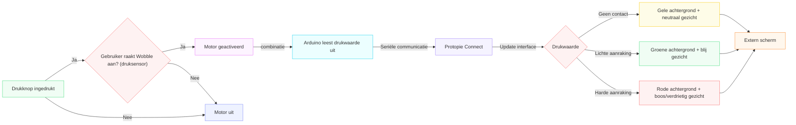

# Algemene werking
In dit bestand wordt uitgelegd hoe het project algemeen te werk gaat.

Binnen dit project werd voornamelijk gewerkt op :
- de visuele interface van Wobble,
- de integratie van een motorisch component,
- communicatie tussen Arduino en Protopie.

Het systeem werkt op basis van een druksensor (FSR). Wanneer een gebruiker Wobble aanraakt, leest Arduino een drukwaarde uit. Deze waarde wordt vervolgens doorgestuurd naar Protopie Connect, waarna de interface op een extern scherm (gsm) reageert.

De interface verandert afhankelijk van de hoeveelheid druk :
- geen contact → gele achtergrond + neutraal gezicht,
- lichte aanraking (zoals aaien of knuffelen) → groene achtergrond + blij gezicht,
- harde aanraking → rode achtergrond + boos/verdrietig gezicht.

Hierdoor ontstaat een directe koppeling tussen fysieke interactie en visuele feedback.

    Figuur 1. Flowchart

Daarnaast werd ook een motorisch component toegevoegd. Een drukknop bepaalt of Wobble actief staat. De motor wordt enkel geactiveerd wanneer :
1. Wobble aanstaat via de drukknop,
2. Er aanraking wordt gedetecteerd via de druksensor.

Zo wordt vermeden dat de motor constant actief blijft.

## Originele Diagram

Figuur 2. Originele diagram

Initieel was dit diagram ons eerste idee voor het project. Wegens de vele bedrading bij de matrix werd het scherm vervangen door het scherm met protopie. Er werd bovenop de gezichtsuitdrukkingen ook een kleurenovergang gemaakt om de feedback visueler voor te stellen.
Omdat de figma app voor project gebruiksgericht volledig overbodig was hadden we ons meer gefocust op het scherm met protopie en hadden we besloten het scherm weg te laten.