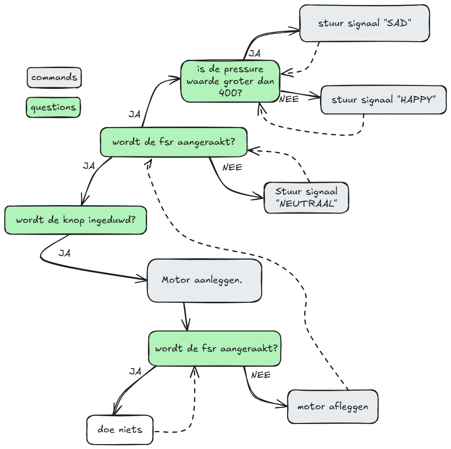

# Arduino Code Documentatie

**Auteur(s) :**
- De Bleser, Axelle; Rootsaert, Selena

## 1. Inleiding
Initieel werden alle onderdelen individueel getest. Dit werd gedaan door een kleine code te schrijven om de waarde uit te lezen en te printen op de seriële monitor. 

Nadat alle codes van de onderdelen duidelijk waren werd de volledige code van het project geschreven.
Deze code is hieronder te vinden.


<details>
<summary>Volledige code</summary>

```cpp
//variabelen fsr
int fsrpin = 0;       // force sensitive resistor analoge pin 0 -> met 10K resistor
int fsrwaarde;        // een variabele voor het uitlezen van de fsr waarde

//variabelen DC motor
int motorpin1 = 13;
int motorpin2 = 12;
int ena = 11;

//varianelen knop
int knoppin = 3;
int knop;
int knopteller = 1;


void setup() {
  Serial.begin(9600);
  
  pinMode(fsrpin, INPUT);

  pinMode(motorpin1, OUTPUT);
  pinMode(motorpin2, OUTPUT);
  pinMode(ena, OUTPUT);

  pinMode(knoppin, INPUT);

  digitalWrite(motorpin1, LOW);       //de motor afleggen
  digitalWrite(motorpin2, LOW);
  analogWrite(ena, 100);               //de snelheid van de motor bepalen (0 = af en 255 = max snelheid)


}

void ademhulp() {                         //motor aanleggen en tonen op Seriële monitor
  digitalWrite(motorpin1, HIGH);
 // Serial.println("AAN");
}

void ademhulp_uit() {                     // motor uitzetten en tonen op Seriële monitor
  digitalWrite(motorpin1, LOW);
 // Serial.println("UIT");
}

void loop() {
  fsrwaarde = analogRead(fsrpin);         //de fsr waarde constant aflezen en opslaan
//  Serial.print("waarde fsr = ");          //fsr waarde ter controle printen in seriële monitor
  Serial.print("VALUE||");
  Serial.println(fsrwaarde);
  delay(100);

  knop = digitalRead(knoppin);            //de knopwaarde van de knoppin aflezen


  if (knop == HIGH){                      // als de knop ingeduwd wordt de knopteller even maken
    knopteller += 1;
    delay(500);
  }

  if ((knopteller % 2) == 0){             //als de knopteller even is ademhulp aanleggen en de knopteller terug oneven maken
    ademhulp();
    knopteller += 1;
  }

  if (((knopteller % 2) != 0) && (!(fsrwaarde > 15))){       //als de knopteller oneven is en de fsr wordt niet meer aangeraakt de ademhulp afleggen
    ademhulp_uit();
  } 


 if (fsrwaarde < 50){
  Serial.println("NEUTRAL");
 }

 if (fsrwaarde > 400){
  Serial.println("SAD");
 }

 if ((50 < fsrwaarde) && (fsrwaarde < 400)){
  Serial.println("HAPPY");
 }


}

```

</details>

## 2. Werking

<p align="center">
  
  <br>
  Figuur 1. functieschema
</p>


In dit functieschema is de volledige werking van de code weergegeven.