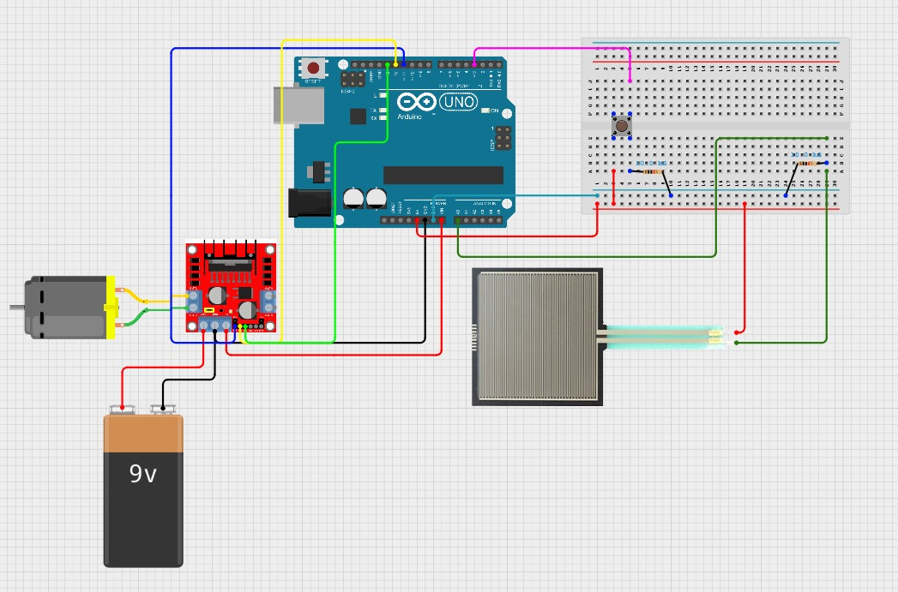

# Fysiek prototype
In dit bestand wordt uitgelegd hoe het prototype fysiek in elkaar zit.

## wiring diagram

##### Onderdelen
- Arduino Uno
- H-brug: L298N
- drukknop
- 9V battery pack
- force resistance sensor
- DC motor
- 2x 10K ohm weerstand

  
   
  Figuur 1. functieschema

