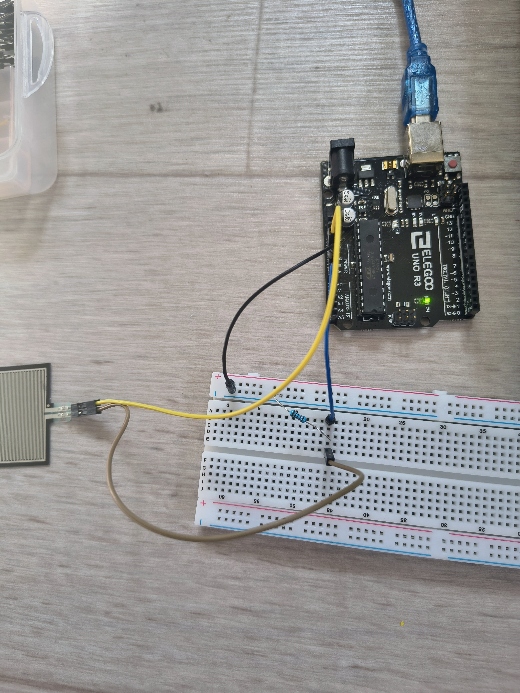
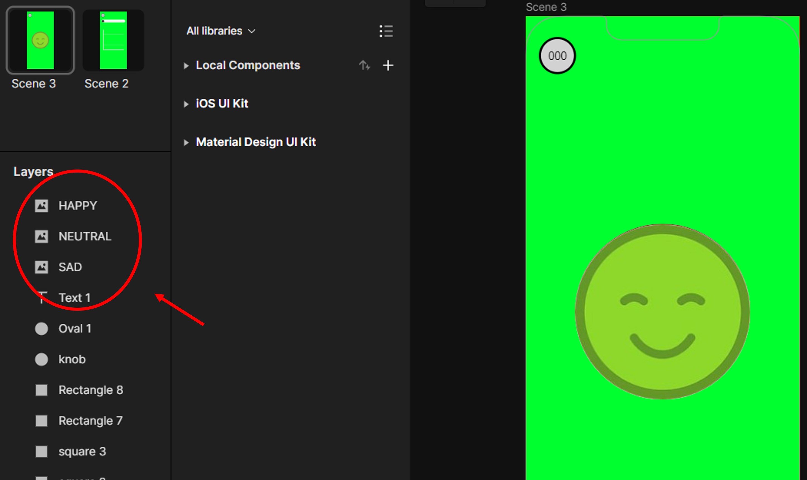
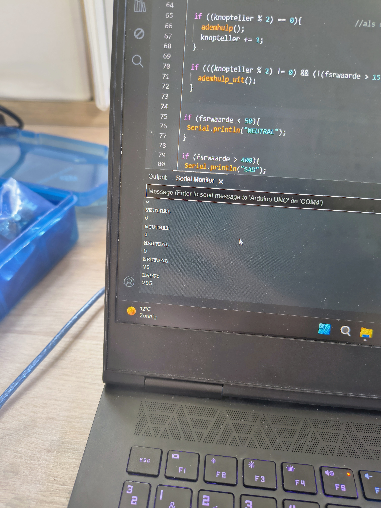
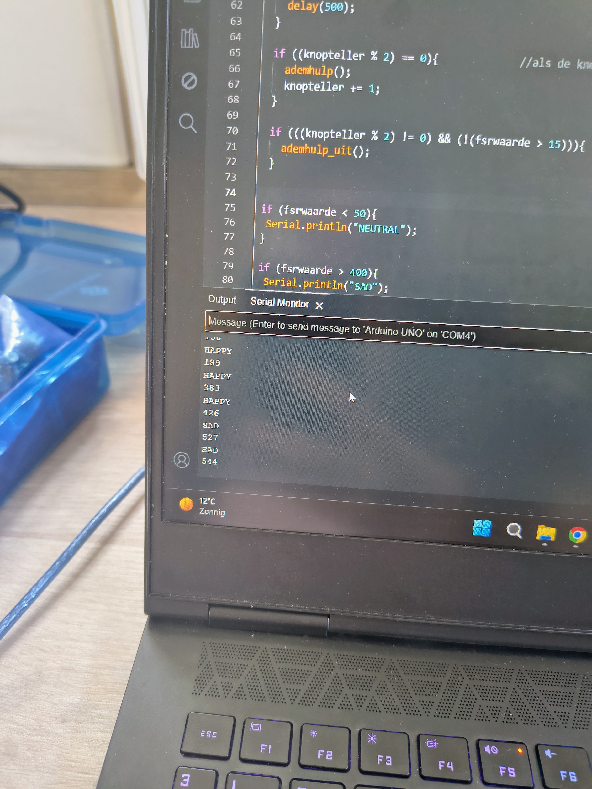
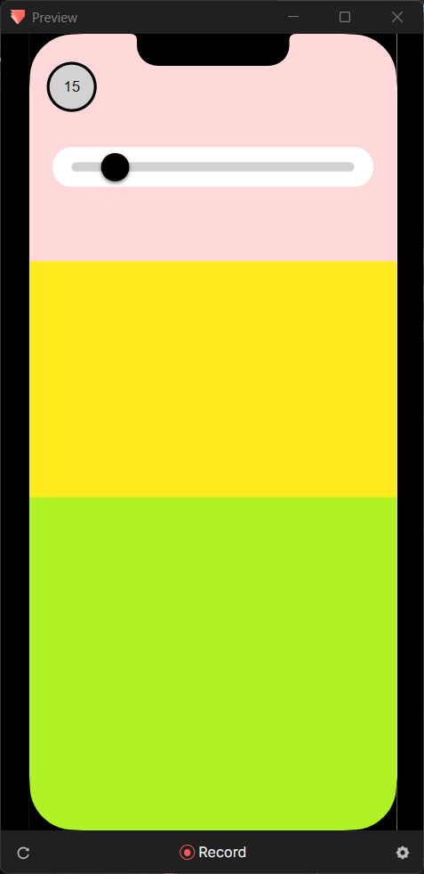
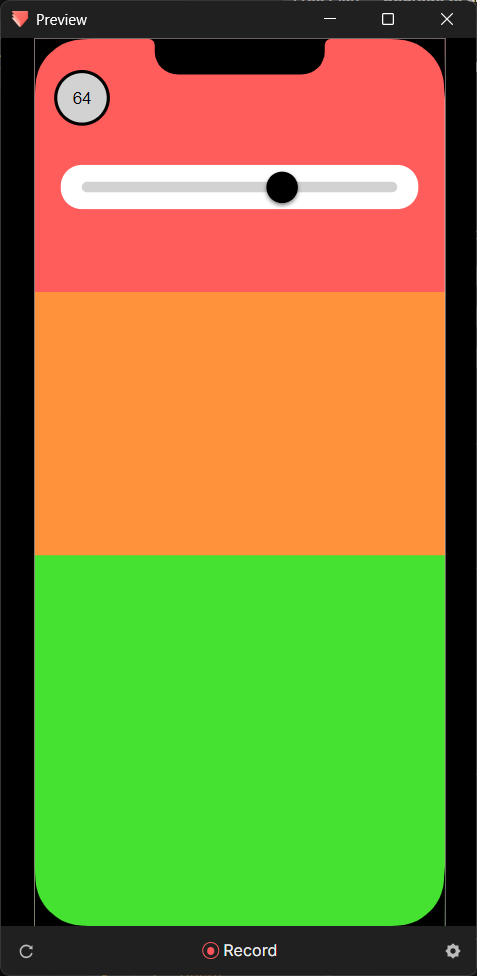

# Protopie Documentation
*Visuele logica en Arduino-integratie*

**Auteur(s) :**
- Rootsaert, Selena

## 1. Overzicht systeemwerking

De Protopie-interface van Wobble vertaalt een analoge druksensor (FSR) naar een dynamische visuele toestand. De interface bestaat uit drie emotionele states :
- **NEUTRAL (geel)**
- **HAPPY (groen/blij)**
- **SAD (rood/verdrietig)**

De Arduino leest de drukwaarde en stuurt deze via serial communicatie naar Protopie Connect. De interface reageert realtime door zowel de **achtergrondkleur** als de **positie van UI-elementen** aan te passen.


## 2. Arduino logica en threshold mapping

De eerste iteratie bestond uit een eenvoudige classificatie van de FSR-waarden in drie zones.

Arduino code (iteratie 1)
```cpp
Serial.println(fsrwaarde);

if (fsrwaarde < 50){
  Serial.println("NEUTRAL");
}

if (fsrwaarde > 400){
  Serial.println("SAD");
}

if ((50 < fsrwaarde) && (fsrwaarde < 400)){
  Serial.println("HAPPY");
}
```

**Werking**
- Lage druk → NEUTRAL
- Middelmatige druk → HAPPY
- Hoge druk → SAD


<p align="center">
  
  <br>
  Figuur 1. Arduino schakeling met FSR sensor
</p>


## 3. Protopie : emotie-sturing via Receive + Reorder

In Protopie wordt de ontvangen waarde gebruikt om de zichtbare emotie te bepalen. Alle gezichten worden gestapeld en afhankelijk van input naar voren gebracht.

```
receive (protopie connect "SAD");
reorder 'SAD' : bring to front, delay 0

receive (protopie connect "HAPPY");
reorder 'HAPPY' : bring to front, delay 0

receive (protopie connect "NEUTRAL");
reorder 'NEUTRAL' : bring to front, delay 0
```

**Werking**
- Alle emotie-lagen bestaan simultaan in de interface
- Enkel de actieve state wordt zichtbaar gemaakt door z-order manipulatie
- Overgangen zijn instant (delay = 0)

<p align="center">
  
  <br>
  Figuur 2. Protopie layers (SAD / HAPPY / NEUTRAL stacking)
</p>

<p align="center">
  
  
  <br>
  Figuur 3. Data Output
</p>


<p align="center">
  
  <br>
  Video 1. Emotie switching demo
</p>


## 4. Achtergrondgradient : Slider-based prototyping

Om de visuele overgang van kleur te testen werd eerst een slider-gestuurde simulatie gebouwd. Dit maakte het mogelijk om de logica te ontwikkelen zonder afhankelijk te zijn van de sensor.

1. Slider beweging (knob control)

```
drag (knob);
move 'knob' : horizontal X[30;330], ratio 100
```
2. Mapping naar pressure variables
```
chain (knob_X);
assign 'variable_pressure' :
- range 1 : X <=> pressure [30;330] <=> [0;100]
```
```
chain (knob_X);
assign 'variable_pressure_green' :
- range 1 : [30;150] <=> [0;100]
- range 2 : [150;200] <=> [100;0]
```
3. Background color blending (opacity layers)

De achtergrond is opgebouwd uit drie overlappende lagen :
```
detect (pressure);
opacity 'square1' (red) : f(x) = pressure - 30

detect (pressure);
opacity 'square2' (yellow) : f(x) = 100 - pressure

detect (pressure);
opacity 'square3' (green) : f(x) = pressure_green
```

<p align="center">
  
  
  <br>
  Figuur 3. Slider interface met kleurgradient
</p>


4. Debug / visual feedback

```
detect (pressure);
text 'text1' : f(x) = round(pressure)
```
**Resultaat**
- Live numerieke feedback van drukwaarde
- Visuele controle van mapping [0–100]


## 5. Arduino → Protopie live data integratie
In de finale versie wordt de slider vervangen door real-time FSR data.

1. Arduino serial output
```cpp
Serial.print("VALUE||");
Serial.println(fsrwaarde);
```
2. Protopie receive mapping
```
receive (protopie connect "VALUE", assign to variable : pressure_value)
```
3. Position mapping (sensor → UI movement)
```
chain (pressure_value);
move 'knob' :
- range 1 : [0;1023] <=> X[30;330] Y[-70;-70]
```

**Interpretatie**
- FSR-waarde (0–1023) wordt lineair gemapt naar UI positie
- Y-as is gefixeerd buiten zicht (-70) om slider “virtueel” te laten bewegen
- X-as bepaalt volledige interactiepositie


<p align="center">
  
  <br>
  Video 2. Colour Changing
</p>